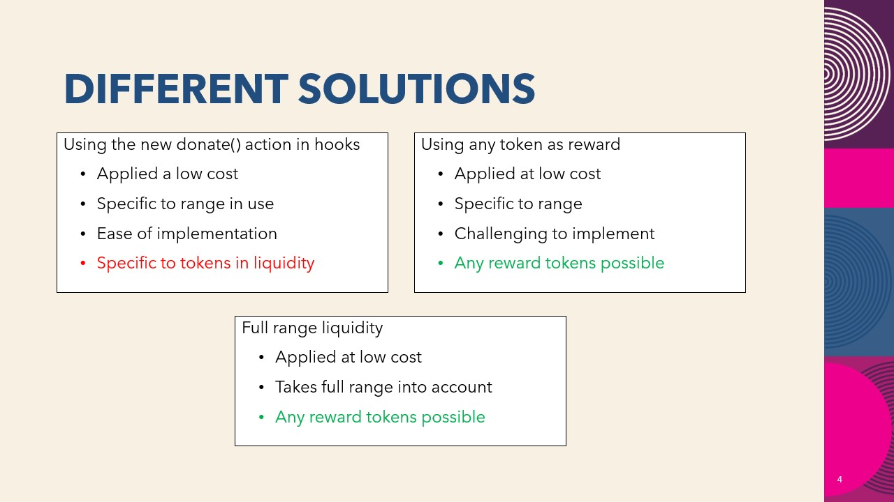

# Stake Hooks
Provide liquidity incentives without external contracts and automatically !
## The problem it solves
### Current Challenges with Liquidity Incentives:

Locking liquidity positions for incentives in DeFi protocols like Uniswap presents several drawbacks. It introduces external risks, as it's often using external smart-contracts for locking and calculating the rewards. This creates friction for users, and was already a challenge with Uniswap v3. The user has to loose ownership during the rewards process, the external smart-contract getting the ownership.

### Further Issues

#### User Awareness
Users might miss out on available incentives because they forget or don't consider them worthwhile for small liquidity possitions.

#### Gas Fees
The process can be gas-intensive, adding another layer of cost and complexity.

### Introducing Stake-Hooks with Uniswap v4
Uniswap v4 introduces hooks, which Stake-Hooks leverages to simplify implementations and user participation in liquidity incentives and mining.
By offering various incentive structures directly through hooks, Stake-Hooks aims to lower the barrier to entry and make the process more accessible for users.

.

#### Improvements
This project simplify the creation of liquidity incentives / liquidity minning opportunities
It breaks down user-related issues into separate cases for better adaptability and optimisation.
It emphasizes the possibles solutions provided by Hooks with Uniswap v4.

## Challenges we ran into
Finding solutions for this features came to be more challenging as time went on, with differents possibilities we thought about, but then found leaks in them.

### Possibles improvements
Adding more tests.
We would also have liked to do an implementation similar to the donate() one, but with any rewards token.
Lots of small optimisations we thought about but couldn't take time / risks to make them.

### What's next
reworking / optimising the current hooks
Checking their limits / trying other ways that could be interresting
Adding auto-compound